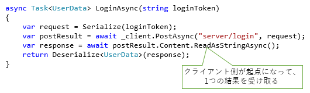
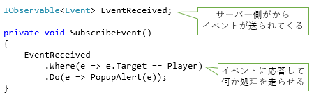

# Unity上でasync/await: 背景 (UnityAsync1Background)

まずasync/awaitについて、
(Unityでない)通常のC#開発の場合がどうとか、
Unityで何が問題で使えなかったかとか、
Rxとの住み分けとかについて書こうかと思います。

## C# 5.0: async/await の登場

C#界隈で非同期処理がらみの話題がホットになったのはだいたい2010年前後からです。

当時は、

- F# にコンピューテーション式による async ワークフローが登場
- 本家の[Rx](https://rx.codeplex.com/)
- これらから少し遅れて、C# 5.0 (async/await)のプレビュー版が登場 

という感じです。

最近になって、Rxを参考にした非同期処理ライブラリが、
[Java](https://github.com/ReactiveX/RxJava)や
[JavaScript](https://github.com/Reactive-Extensions/RxJS)などで実装されていて注目されていますが、
その一方で、C#ではC# 5.0のasync/awaitが主流になりました。

理由はおおむね、

- async/await はプログラミング言語側のサポートが必要
- async/await が出ることが分かっていたので、それとは違うモデルの Rx の普及にはみな慎重だった

という辺りです。逆に言うと、

- C# のバージョンが古いUnityでは、いまだ[Rx](https://github.com/neuecc/UniRx)にかかる期待は大きい
- JavaScriptにもES7でasync/awaitが入り、(後述の住み分けはあるものの、それが合う場面では)async/awaitが主流になっていくと思われる

ということも言えます。

## async/awaitとRx

今回、「Unityでもasync/awaitを使えるようにしたよ」という話をするわけですが、
これでRxはお役御免になるかというとそうでもなくて、Rxの用途は残ります。基本的には、

- async/await: pull型で、1つの値を取りに行く場合に有効
- Rx: push型で、ストリームデータを送ってもらう場合に有効

という住み分けになります。

例えば、サーバーからデータを受け取るような場合を想定すると、async/awaitがよさそうな場面は

- ログイン時、ユーザーデータを一括で取りたい
- ユーザーの行動時、即座に決まる範囲で行動の結果を返してもらいたい

Rxがよさそうな場面は

- 他のユーザーの行動で、自分が受ける影響をサーバーからpush通知してほしい

とかになります。

## UnityでC# 6.0

Unityの問題は、使っているMonoのバージョンが古いことで、確か2.8系(.NET 3.5/C# 3.0相当、オプション引数とか一部だけC# 4.0機能を先行取り込み)だったはず。

ですが、C#は、古いフレームワーク上でも最新の言語機能を使えたりします。
詳しくは「[C#の言語バージョンと.NET Frameworkバージョン](http://ufcpp.net/study/csharp/cheatsheet/listfxlangversion/)」で書いていますが、
ここで「2.0や3.0で動く」となっている機能は、コンパイラーさえバージョンアップすればUnity上でも使えます。

例えば、C# 6.0の新機能の大半は何もしなくても古いフレームワーク上で動きます。
Caler Info属性や、`FormattedString` は、簡単なクラスの自作で動かせます。
async/await は結構重たいですが、頑張って実装すれば動かせます(これが本稿の主題)。

### コンパイラーの差し替え

C# 6.0コンパイラーを使う方法は大きく分けると2種類あって、

- Unity が使っているコンパイラーを差し替えてしまう(実際にやっている人あり: [Unity C# 5.0 and 6.0 Integration](https://bitbucket.org/alexzzzz/unity-c-5.0-and-6.0-integration/src))
- ロジックの大部分をUnityの外でコンパイルしてしまう

となります。

うちは、どのみちロジックの大部分をUnityの外でも使う(データ編集用のデスクトップ アプリや、サーバー上で動かす)ので、
後者のやり方をしています。

ちなみに、C# プロジェクトのVisual Studio上の「ビルド後処理」設定で、
コンパイルしたDLLをUnity Assetsフォルダー以下にコピーするスクリプトを書いて使っています。

- [CopyDllsAfterBuild](https://github.com/ufcpp/UnityTools/tree/master/CopyDllsAfterBuild)

### Unity に async/await 移植

Unity上でasync/awaitを使おうと思うと、[`Task`クラス](https://msdn.microsoft.com/ja-jp/library/system.threading.tasks.task.aspx)の移植が必要になります。

IL2CPP登場以前だと、そもそも`Task`クラスが内部で使っているいくつかのメソッド、
例えば[`Interlocked.CompareExchange<T>`](https://msdn.microsoft.com/ja-jp/library/bb297966.aspx)とかが
iOS上(AOTコンパイル)で動かないという問題があって、移植は絶望的でした。

が、IL2CPPが安定してきた今、やってみたら案外あっさり移植できたという状態です。

- [MinimumAsyncBridge](https://github.com/OrangeCube/MinimumAsyncBridge)

[導入文](UnityAsync0Introduction)でも書いていますが、あっさり動きすぎて、コミットが少なすぎて非アクティブに見える…

まあ、「Minimum」という名前通り、`Task`クラスのうち、async/awaitに必要な部分だけの実装になります。
例えば、`Run`メソッド(別スレッドで処理を開始する)は実装していません。
これに関しては、他の非同期処理ライブラリ(Unityのコルーチンとか、Rxとか)とつないで使う想定です。

ちなみに、Rxに対するつなぎ処理も書いています。

- [UniRx.AsyncBridge](https://github.com/OrangeCube/MinimumAsyncBridge/tree/master/src/UniRx.AsyncBridge)

`IObservable`に対するawaiter実装になります。

## まとめ

Unity の制限の多くは、Mono 2.8系のAOTコンパイルの制限に起因するものが多いです。
それが、IL2CPPが安定してきたことによって少し緩和しています。

C# 3.0に留まる理由もなくなっていて、async/awaitのバックポーティングもうまくいっています。
その移植したライブラリが以下のものです。

- [MinimumAsyncBridge](https://github.com/OrangeCube/MinimumAsyncBridge)

