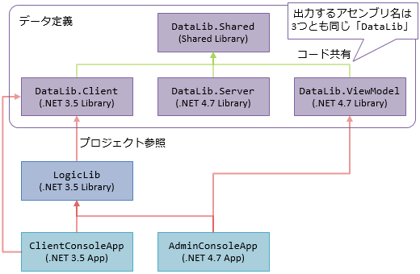

## 背景

通信コントラクトに使うデータ型をコード生成で作りたい。
同じデータ構造を、3系統使い分けたい要件がある。

- クライアント上    : クライアントには見せたくないデータがある(ドロップ品の確率テーブルとか)
- サーバー上        : 全てのデータを読み書きできるけど、プロパティ変更通知は要らない
- データ編集ツール上 : Data Binding 用にプロパティ変更通知したい

別々にコード生成してたんだけど、ずっと別保守がつらいという課題はあった。
Shared Project で何とかならないか試してみる。

## 構成

- `DataLib.*` : 通信コントラクトに使うデータの出力先
  - `Shared`: ここにコード生成で単一のファイルを生成する
  - `Client`: クライアント向け(`#define`シンボル何もなし)
  - `Server`: サーバー向け。全データを見れる(`Admin`シンボルあり)
  - `ViewModel`: 編集ツール向け。全データを見れる+変更通知あり(`Admin`, `NotiryPropertyChanged`シンボルあり)
- `LogicLib`: サバクラ・編集ツールで共通で使う、ロジックが入ったライブラリ
  - 直接的には`DataLib.Client`を参照している
- `*ConsoleApp`: アプリのつもりのもの
  - `Client`: `LogicLib`と`DataLib.Client`を参照しているアプリ
  - `Admin`: `LogicLib`と`DataLib.ViewModel`を参照しているアプリ



## コード生成/共有するコード例

生成元の想定

```cs
[Comment("データ例")]
class Class1
{
    [Comment("全環境で使える想定のプロパティ")]
    int Id;

    [Symbol("Admin")]
    [Comment("クライアントには見せたくない想定のプロパティ")]
    string Secret;
}

```

(`DataLib.Shared`に出力する)生成結果の例

```cs
    /// <summary>
    /// データ例
    /// </summary>
    public class Class1
#if NotiryPropertyChanged
        : BindableBase
#endif
    {
        /// <summary>
        /// 全環境で使える想定のプロパティ
        /// </summary>
        public int Id
#if NotiryPropertyChanged
        { get => _id; set => SetProperty(ref _id, value); }
        private int _id;
#else
        { get; set; }
#endif

#if Admin
        /// <summary>
        /// クライアントには見せたくない想定のプロパティ
        /// </summary>
        public string Secret
#if NotiryPropertyChanged
        { get => _secret; set => SetProperty(ref _secret, value); }
        private string _secret;
#else
        { get; set; }
#endif
#endif
    }
```
