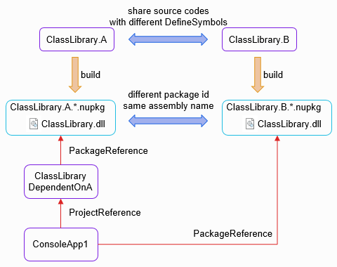

# Inconsistent behavior between Framework Dependent and Self-contained deploy

## step to repro

run [build.ps1](build.ps1)

### expected result

Execution results are consistent with .NET Framework, .NET Core (Framework Dependent), and .NET Core (Self-contained).

The result of `build.ps1` except for build logs is:

```
ClassLibrary.B
ClassLibrary.B
ClassLibrary.B
```

### actual result

That of .NET Core (Framework Dependent) is inconsistent with others.

```
ClassLibrary.B
ClassLibrary.A
ClassLibrary.B
```

## FYI

This solution contains libraries that have different package id and the same assembly name.

Solution architecture:



The `ConsoleApp1` refers

- `ClassLibrary.B` in net47 and netcoreapp2.0 (Self-contained)
- `ClassLibrary.A` in netcoreapp2.0 (Framework Dependent)
