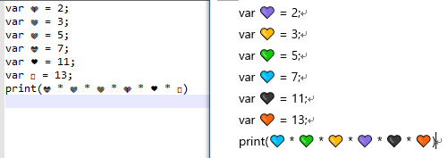
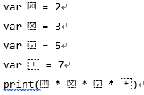

# Emoji Identifiers

Abuse of Emoji identifiers in Swift.

## Color ❤

[❤🧡💛💙💚💜🖤](http://ufcppfree.azurewebsites.net/Grapheme?s=%E2%9D%A4%F0%9F%A7%A1%F0%9F%92%9B%F0%9F%92%99%F0%9F%92%9A%F0%9F%92%9C%F0%9F%96%A4)

```swift
var 💜 = 2;
var 💛 = 3;
var 💚 = 5;
var 💙 = 7;
var 🖤 = 11;
var 🧡 = 13;
print(💙 * 💚 * 💛 * 💜 * 🖤 * 🧡)
```

Some editors support color font but some others do not.



The same is true of skin tones 🧑🏻🧑🏼🧑🏽🧑🏿.

## Sigma

```swift
prefix operator ∑ // 'N-ARY SUMMATION' (U+2211)

prefix func ∑ (array : [Int]) -> Int {
    var sum : Int = 0
    for item in array {
        sum += item
    }
    return sum
}

let a = [ 1, 2, 3, 4, 5]
let Σa = 0 // 'GREEK CAPITAL LETTER SIGMA' (U+03A3) + a

print(∑a) // 15
print(Σa) // 0
```

N-ARY Sum can be used for operators. On the other hand, Greek Capital Letter Sigma can be for identifiers.

## Mathematical Alphanumeric Symbols

[𝟎𝟘𝟢𝟬𝟶](http://ufcppfree.azurewebsites.net/Grapheme?s=%F0%9D%9F%8E%F0%9D%9F%98%F0%9D%9F%A2%F0%9D%9F%AC%F0%9D%9F%B6)

```swift
var 𝟎 = 2;
var 𝟘 = 3;
var 𝟢 = 5;
var 𝟬 = 7;
var 𝟶 = 11;
print(𝟎 * 𝟘 * 𝟢 * 𝟬 * 𝟶)
```

Bold, Double-struck, Sans-serif, Sans-serif bold, and Mono-space 0.

## Invisible Operators

[Invisible Operators](http://ufcppfree.azurewebsites.net/Grapheme?s=%E2%81%A1%E2%81%A2%E2%81%A3%E2%81%A4)

```swift
var ⁡ = 2
var ⁢ = 3
var ⁣ = 5
var ⁤ = 7
print(⁡ * ⁢ * ⁣ * ⁤)
```

From the top

- Function Apply
- Invisible Times
- Invisible Separator
- Invisible Plus

Unicode Code Point: U+2061~2063

Some fonts have visible glyph:


