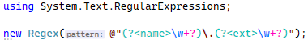

# Embedded Languages

Visual Studio 上で C# コードを書いていると、以下のような構文ハイライトが掛かります。



正規表現の部分にもちゃんと構文ハイライトが掛かっています。

さすがに C# コンパイラー本体がこの処理をしているわけではなくて、プラグインみたいです。
以下のような流れでハイライトが掛かるみたいです。

* C# コンパイラーは [MEF](https://docs.microsoft.com/ja-jp/dotnet/framework/mef/) で拡張機能を足せる作りになっている
* [MSBuildWorkspace はデフォルトで](https://github.com/dotnet/roslyn/blob/834f4057b67df99410e3052bfe64c82043eaa374/src/Workspaces/Core/MSBuild/MSBuild/MSBuildWorkspace.cs#L63)実行ファイルと同一フォルダー内にある MEF コンポーネントをロードする
* [Microsoft.CodeAnalysis.CSharp.Features](https://www.nuget.org/packages/Microsoft.CodeAnalysis.CSharp.Features/) 内に正規表現の構文解析をする MEF コンポーネントが入っている
* 現状の上記パッケージに入っているコード: [Roslyn リポジトリ内の EmbeddedLanguages フォルダー](https://github.com/dotnet/roslyn/tree/main/src/Features/Core/Portable/EmbeddedLanguages)

ということで、Microsoft.CodeAnalysis.CSharp.Features 参照の有無で、`Classifier` の結果が変わります。
[WithoutFeatures](WithoutFeatures)の方は参照なし、
[WithFeatures](WithFeatures)の方は参照ありで、
その他のコードはすべて同じです。
で、これらの実行結果は以下の通り。

WithoutFeatures の方:

```txt
// lang=regex (0-13) : comment
var (15-18) : keyword
s (19-20) : local name
= (21-22) : operator
@"(?<name>\w+?\d{3})\.txt" (23-49) : string - verbatim
; (49-50) : punctuation
Console (52-59) : class name
Console (52-59) : static symbol
. (59-60) : operator
WriteLine (60-69) : method name
WriteLine (60-69) : static symbol
( (69-70) : punctuation
s (70-71) : local name
) (71-72) : punctuation
; (72-73) : punctuation
```

WithFeatures の方:

```txt
// lang=regex (0-13) : comment
var (15-18) : keyword
s (19-20) : local name
= (21-22) : operator
@"(?<name>\w+?\d{3})\.txt" (23-49) : string - verbatim
( (25-26) : regex - grouping
? (26-27) : regex - grouping
< (27-28) : regex - grouping
name (28-32) : regex - grouping
> (32-33) : regex - grouping
\ (33-34) : regex - character class
w (34-35) : regex - character class
+ (35-36) : regex - quantifier
? (36-37) : regex - quantifier
\ (37-38) : regex - character class
d (38-39) : regex - character class
{ (39-40) : regex - quantifier
3 (40-41) : regex - quantifier
} (41-42) : regex - quantifier
) (42-43) : regex - grouping
\ (43-44) : regex - self escaped character
. (44-45) : regex - self escaped character
txt (45-48) : regex - text
; (49-50) : punctuation
Console (52-59) : static symbol
Console (52-59) : class name
. (59-60) : operator
WriteLine (60-69) : static symbol
WriteLine (60-69) : method name
( (69-70) : punctuation
s (70-71) : local name
) (71-72) : punctuation
; (72-73) : punctuation
```

